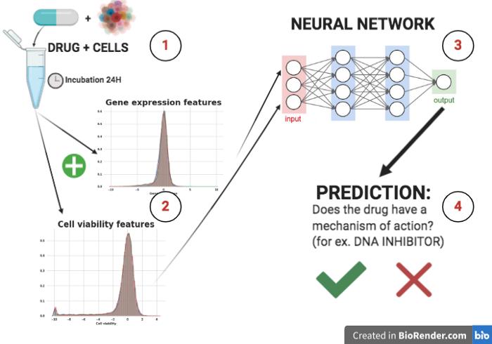
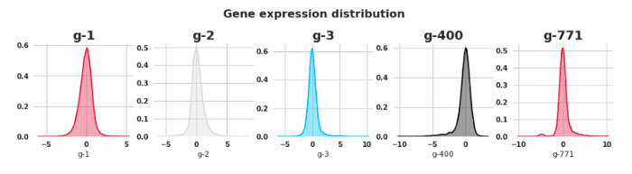
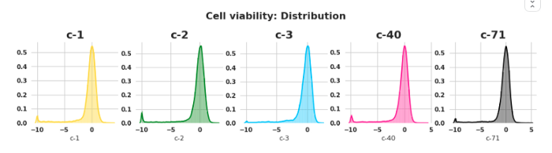

# Mechanisms of Action (MoA) Prediction

_Develop an efficient algorithm for classifying drugs based on their biological activity._

## :dart: Goal

The project goal is to predict the Mechanism of Action (MoA) response(s) of different samples (sig_id) using various inputs such as gene expression data and cell viability data.

## :book: About

The [Connectivity Map](https://clue.io/), a project within the Broad Institute of MIT and Harvard, the [Laboratory for Innovation Science at Harvard (LISH)](https://lish.harvard.edu/), and the [NIH Common Funds Library of Integrated Network-Based Cellular Signatures (LINCS)](https://lincsproject.org/), present this challenge with the goal of advancing drug development through improvements to MoA prediction algorithms.[(1)](#link-references)

> What is the Mechanism of Action (MoA) of a drug? And why is it important?

In pharmacology, the term mechanism of action (MOA) refers to the specific biochemical interaction through which a drug substance produces its pharmacological effect.[(2)](#link-references) A mechanism of action usually includes mention of the specific molecular targets to which the drug binds, such as an enzyme or receptor.[(3)](#link-references)

In the past, drugs were often derived from natural sources or traditional remedies without a clear understanding of how they worked. For example, paracetamol (known as acetaminophen in the US) was used clinically for decades before its biological mechanisms were fully understood. However, with technological advances, drug discovery has shifted towards a more targeted approach. Scientists now aim to identify the specific protein associated with disease and develop a molecule that can interact with it. To describe a molecule's biological activity, scientists use a label called mechanism-of-action (MoA).

> How do we determine the MoAs of a new drug?

One approach is to treat a sample of human cells with the drug and then analyze the cellular responses with algorithms that search for similarity to known patterns in large genomic databases, such as libraries of gene expression [GEO](https://www.ncbi.nlm.nih.gov/geo/), [EMBL-EBI Expression Atlas](https://www.ebi.ac.uk/gxa/home) or cell viability patterns of drugs with known MoAs.

<div align="center">
  
</div>

## :chart_with_upwards_trend: Evaluation Metric

Based on the MoA annotations, the accuracy of solutions will be evaluated on the average value of the [logarithmic loss function](https://www.kaggle.com/c/lish-moa/overview/evaluation) applied to each drug-MoA annotation pair.

## :floppy_disk: Dataset

In this challenge, we can access a unique dataset that combines gene expression and cell viability data. This data is based on a new technology that measures human cells' responses to drugs in a pool of 100 different cell types, solving the problem of identifying which cell types are better suited for a given drug. Additionally, we have access to MoA annotations for over 5,000 drugs in this dataset.

The training data provides an optional set of MoA labels that are not included in the test data and are not used for scoring.

<div align="center">
  
  
</div>

**List of files:**

- `train_features.csv` - Features for the training set. Features g- signify gene expression data, and c- signify cell viability data. cp_type indicates samples treated with a compound (cp_vehicle) or with a control perturbation (ctrl_vehicle); control perturbations have no MoAs; cp_time and cp_dose indicate treatment duration (24, 48, 72 hours) and dose (high or low).
- `train_drug.csv` - This file contains an anonymous drug_id for the training set only.
- `train_targets_scored.csv` - The binary MoA targets that are scored.
- `train_targets_nonscored.csv` - Additional (optional) binary MoA responses for the training data. These are not predicted nor scored.
- `test_features.csv` - Features for the test data. You must predict the probability of each scored MoA for each row in the test data.
- `sample_submission.csv` - A submission file in the correct format.

## :hammer_and_wrench: Data Preprocessing Pipeline

> :warning: **Important**: The data processing pipeline is integrated with the Kaggle API. So before getting started, ensure to [configure your Kaggle API credentials](#closed_lock_with_key-how-to-use-the-kaggle-api).

To build a preprocessing pipeline, run the command `make data` in your terminal. This command triggers a chain of scripts in the following order:

1. Check the `data/raw` directory to make sure there is a training dataset.
2. Download the dataset from the Kaggle server if `data/raw` is empty, or skip this step otherwise.
3. Extract the downloaded dataset to the `data/raw` directory
4. Delete the downloaded zip file
5. Perform feature engineering tasks to prepare the dataset for training
6. Perform feature selection
7. Save the prepared dataset in the `data/processed` directory

Alternatively, you can retrieve the dataset manually. It does not harm the data preprocessing pipeline.

## :inbox_tray: How to Retrieve the Dataset Manually

To obtain data manually, follow the next steps:

1. Sign in to your [Kaggle](https://www.kaggle.com/) account or sign up if you still need one.
2. Accept [MoA competition rules](https://www.kaggle.com/c/lish-moa/rules) - it will grant you full access to MoA competition data.
3. Download the [dataset](https://www.kaggle.com/c/lish-moa/data).
4. Unzip the downloaded `lish_moa.zip` file to the `data/raw` project directory.

## :rocket: Models

In our project, we utilize four deep learning models: FNN (Feedforward Neural Network), ResNet (Residual Network), FTTransformer (Feature Transformer), and TabNet.

FNN captures complex relationships and serves as a baseline model. ResNet addresses deep network training with gradient propagation through residual connections. FTTransformer excels in handling high-dimensional tabular data. TabNet combines deep networks and attention mechanisms for complex tabular scenarios.

By incorporating these models, we explore diverse approaches and leverage their strengths to improve multiclass drug classification performance.

### TabNet

<div align="center">
  
</div>

## :gear: The Project Automation Workflow

This project's automation workflow is built on [Make GNU](https://www.gnu.org/software/make/), which uses a Makefile as its core. The Makefile includes CLI rules written in C as `make` commands. These commands connect all the processes in the project at a high level of abstraction. Refer to the table below for all the `make` commands used in this project.

#### All `make` commands

| Command                 | Description                      | Prerequisite       |
| ----------------------- | -------------------------------- | ------------------ |
| `make env`              | Create a virtual environment     |                    |
| `source moa activate`   | Activate virtual environment     |                    |
| `make test_env`         | Test virtual environment         |                    |
| `make requirements`     | Install dependencies             | `test_environment` |
| `make raw_data`         | Download and extract data from Kaggle     |                    |
| `make data`             | Make data preprocessing pipeline | `get_data`         |
| `make train`            | Initialize model training        | `data`             |
| `make pred`             | Make prediction                  | `train`            |
| `make report`           | Create report                    |                    |
| `make clean`            | Delete all compiled Python files |                    |
| `make lint`             | Lint using flake8                |                    |
| `make help`             | List all targets and descriptions|                    |

**What Does the `Prerequisite` Column Mean?**

In the `Prerequisite` column, you can see which commands require a specific condition to be met. For instance, the `make train` command requires `data` to be prepared beforehand. However, you do not have to run the prerequisites manually. When you execute the target command, it automatically runs the prerequisite and only proceeds if it is successful.

## :closed_lock_with_key: How to Use the Kaggle API

Follow these steps to set up the Kaggle API credentials:

1. Create a new Kaggle API token, according to the [instructions](https://www.kaggle.com/docs/api#getting-started-installation-&-authentication).
2. Save obtained `kaggle.json` file to the `~/.kaggle` folder.

> 📌 **Note:** If you need to store the Kaggle API token in an environment location, you must set the **KAGGLE_CONFIG_DIR** environment variable to the path where you store the Kaggle API token **kaggle.json**. For example, on a Unix-based machine, the command would look like this:

```bash
  export KAGGLE_CONFIG_DIR=/home/user/miniconda3/envs/moa/bin
```

For your security, ensure that other users of your computer do not read access to your credentials:

```bash
  chmod 600 ~/.kaggle/kaggle.json
```

You can also choose to export your Kaggle username and token to the environment:

```bash
  export KAGGLE_USERNAME=niander_wallace
  export KAGGLE_KEY=xxxxxxxxxxxxxx
```

Follow the [documentation](https://www.kaggle.com/docs/api) to learn more about the Kaggle API and how to use Kaggle CLI tools.

## :open_file_folder: Project Organization

    ├── LICENSE
    ├── Makefile           <- Makefile with commands like `make data` or `make train`
    ├── README.md          <- The top-level README for developers using this project
    ├── data
    │   ├── predictions    <- Predicted targets
    │   ├── processed      <- The final, canonical data sets for modeling. Obtained after
    │   │                     preprocessing, merging, cleaning, feature engineering etc.
    │   └── raw            <- The original, immutable data dump. Should be considered as read only.
    ├── logs               <- Logs and tensorboard event files
    ├── drafts             <- Drafts, hypothesis testing
    │
    ├── models             <- Trained and serialized models, model predictions, or model summaries
    │   └── configs        <- Config files for implemented models
    ├── notebooks          <- Jupyter notebooks. Naming convention is a number (for ordering),
    │   │                     the creator's initials, and a short `-` delimited description, e.g.
    │   │                     `1.0-os-initial-data-exploration`
    │   ├── exploratory    <- Contains initial explorations
    │   └── reports        <- Works that can be exported as html to the reports directory
    │
    ├── notes              <- Notes, ideas, experiment tracking, etc.
    │
    ├── references         <- Data dictionaries, manuals, and all other explanatory materials
    │
    ├── reports            <- Generated analysis as HTML, PDF, LaTeX, etc.
    │   └── figures        <- Generated graphics and figures to be used in reporting
    │
    ├── requirements.txt   <- The requirements file for reproducing the analysis environment, e.g.
    │                         generated with `pip freeze > requirements.txt`
    │
    ├── setup.py           <- Makes project pip installable (pip install -e .) so src can be imported
    ├── src                <- Source code for use in this project
    │
    ├── test_environment   <- Test python environment is setup correctly
    │
    └── tox.ini            <- tox file with settings for running tox; see tox.readthedocs.io

## :bulb: How to Reproduce the Solution

To reproduce the solution, do the following:

1. Clone the repository: `git clone https://github.com/oleksandrsirenko/mechanisms-of-action-moa-prediction.git moa`
2. [Get dataset manually](#inbox_tray-how-to-get-data) or [configure the Kaggle API](#closed_lock_with_key-how-to-use-the-kaggle-api) to automate this process.
3. Create the virtual environment for the project: `make environment`
4. Activate the virtual environment: `source moa activate`
5. Install dependencies: `make requirements`
6. Prepare dataset: `make data`
7. Train models: `make train`
8. Make predictions: `make prediction`

## :link: References

 1. [Mechanisms of Action (MoA) Prediction](https://www.kaggle.com/c/lish-moa).
 2. Spratto, G.R.; Woods, A.L. (2010). Delmar Nurse's Drug Handbook. Cengage Learning. ISBN 978-1-4390-5616-5.
 3. Grant, R.L.; Combs, A.B.; Acosta, D. (2010) "Experimental Models for the Investigation of Toxicological Mechanisms". In McQueen, C.A. Comprehensive Toxicology (2nd ed.). Oxford: Elsevier. p. 204. ISBN 978-0-08-046884-6.
 4. Corsello et al. [“Discovering the anticancer potential of non-oncology drugs by systematic viability profiling”](https://doi.org/10.1038/s43018-019-0018-6), Nature Cancer, 2020.
 5. [GEO](https://www.ncbi.nlm.nih.gov/geo/) is a public functional genomics data repository supporting MIAME-compliant data submissions.
 6. [EMBL-EBI Expression Atlas](https://www.ebi.ac.uk/gxa/home)
 7. Subramanian et al. [“A Next Generation Connectivity Map: L1000 Platform and the First 1,000,000 Profiles”](https://doi.org/10.1016/j.cell.2017.10.049), Cell, 2017.
 8. [Connectopedia](https://clue.io/connectopedia/glossary) is a free, web-based dictionary of terms and concepts related to the Connectivity Map (including definitions of cell viability and gene expression data in that context).
 9. [Transfer Learning with Deep Tabular Models](https://arxiv.org/abs/2206.15306), arXiv, 2023.

## Current Status

> In progress

TODO:

- [x] Define project structure
- [x] Automate workflow with Makefile
- [x] Integrate Kaggle API
- [x] Create helper functions
- [x] Create data preprocessing pipeline
- [x] Make Dataset class
- [x] Build MLP model
- [x] Construct training loop
- [x] Build ResNet model
- [x] Implement model factory
- [x] Implement cross-validation
- [x] Monitor and log experiments
- [ ] Build FTTransformer for transfer learning
- [ ] Build TabNet model for transfer learning
- [ ] Conduct feature engineering
- [ ] Tune hyperparameters
- [ ] Perform model interpretation and explainability, compare models
- [ ] Ensemble models (including MLP, ResNet, and FTTransformer, TabNet)
- [ ] Make inference using the ensemble of models
- [x] Document and organize code
- [ ] Automate report fetching
- [ ] Prepare visualizations and figures to support the findings
- [ ] Write a research report or paper summarizing the findings
